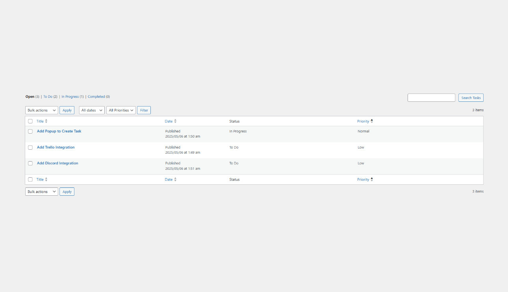
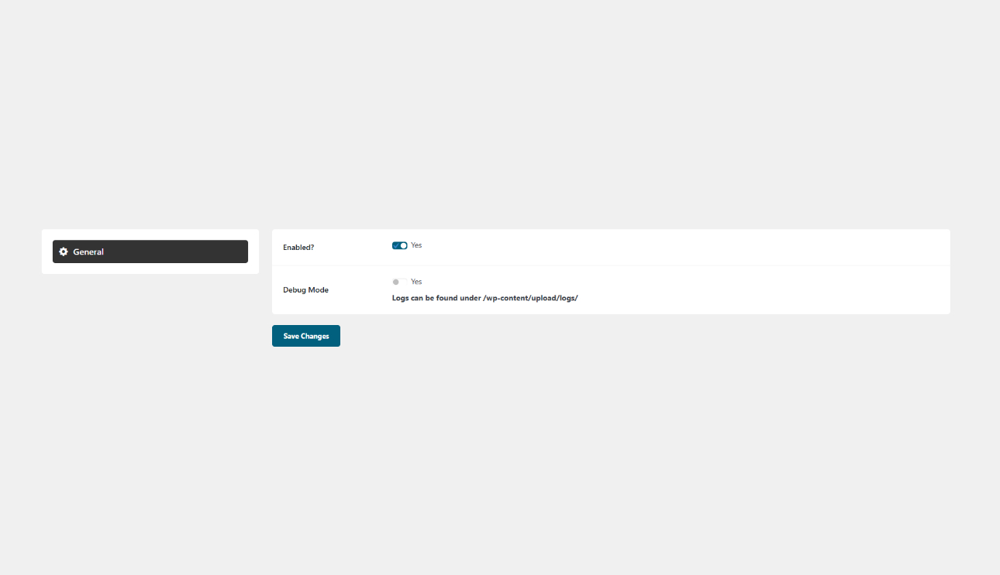

## Description

ProjectPlot is a powerful and intuitive WordPress plugin that transforms your WordPress backend into a centralized hub for managing tasks. There are of course tools out there for project management, but for small businesses it's generally a lot of extra steps just create a task. This is built with small teams in mind, this way you can create tasks using a system you are already familiar with, without the need to load or install an additional application.

### Features

- Task creation
- Set task name
- Set task description
- Set task priority
- Set task status
- ClickUp integration via our [ProjectPlot Suite](https://www.dogbytemarketing.com/shop/projectplot-suite/)

## Roadmap

- Add ability to add projects and have it filterable
- Add additional integrations

## Installation

1. Backup your WordPress site.
2. Upload the plugin files to the `/wp-content/plugins/` directory, or install the plugin through the WordPress plugins screen directly.
3. Activate the plugin through the 'Plugins' screen in WordPress.

## Screenshots

## Changelog

### 1.0.0
- Initial Release